# MultiZ - a self assembled multiplane prism
Below are the detailed instructions on how to maufacture the gluing tool and mount for assembling a MultiZ prism. 

# Gluing tool
The gluing tool should be fitted on a Thorlabs Optical Post/holder. This could be on an optical post or directly in the optical holder. The holder and optical post are already available in the lab.

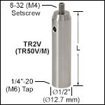

The first design is made for the a set of four prisms. For threading or inserting. The idea was to 3D-print the gluing tool, though it is designed that it also could be (CNC) machined. This was done in the case the fitting or the alignment of the 3D-printing was insufficient.  

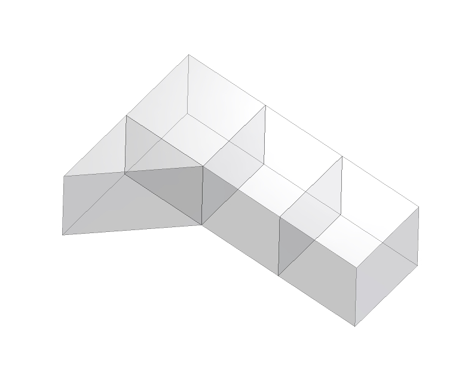

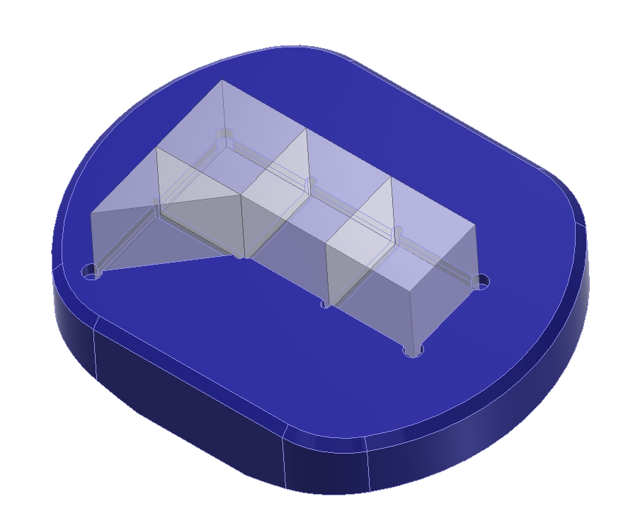

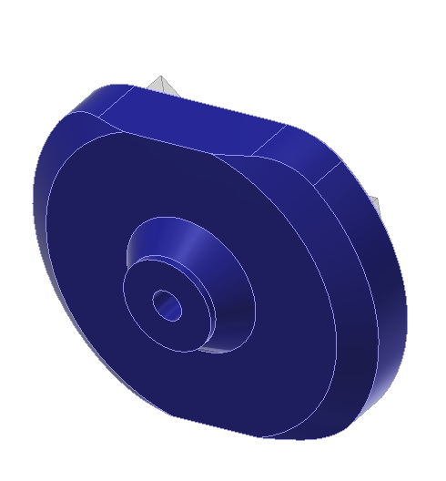

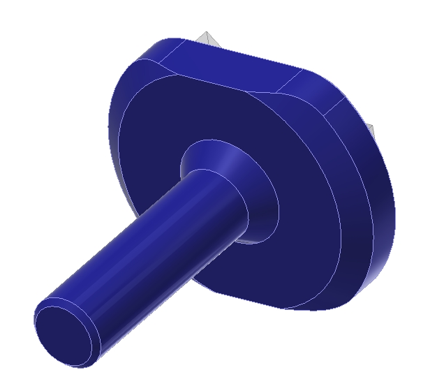 

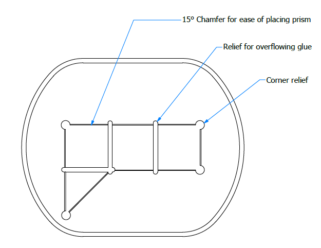

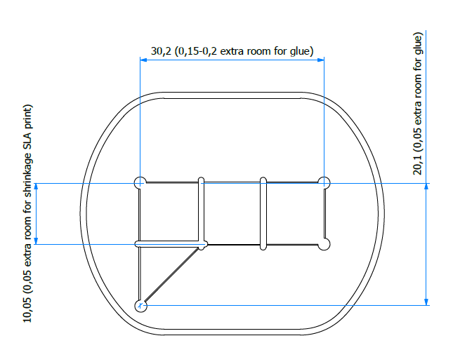

The parts are printed on an EnvisionTec Perfactory 4 Mini XL in the material R05 with a layer thickness of 0,05mm. Print is setup with Magics and sliced by Perfactory. 

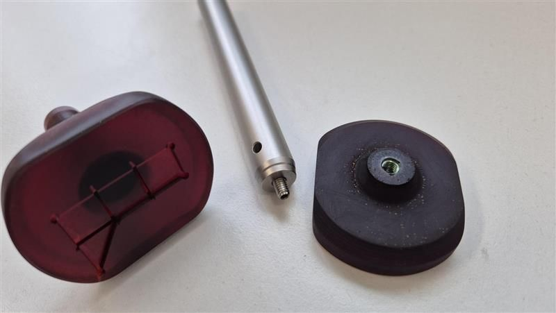

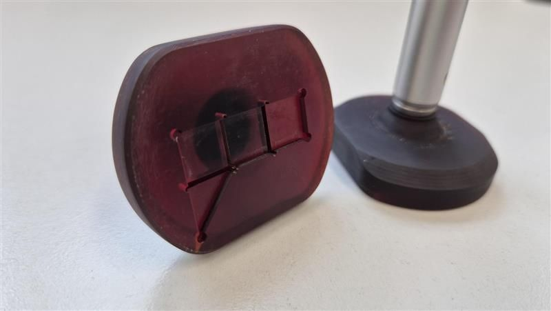

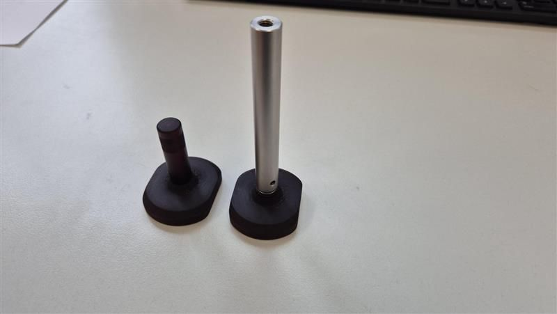

The existing glued prism does fit in the gluing tool properly. For other designs, a new gluing tool needs to be printed.

# Mount

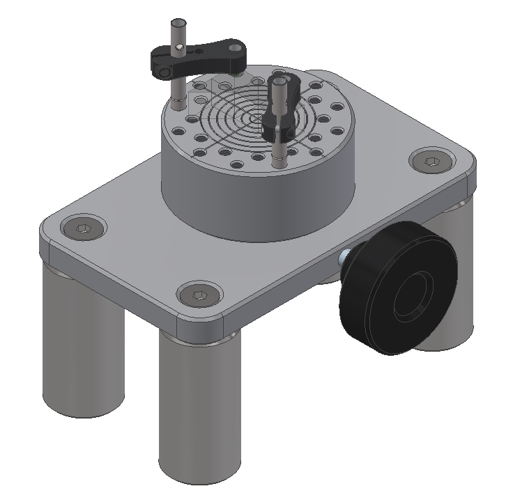

The mount currently comprises of a platform supported on four pillars. On top of the pillars a flat plate is mounted. The flat plate has a hole for the rotating platform. The rotating platform has multiple M4 mounting holes to place a Thornlabs PM3/M Small Adjustable Clamping Arm. A crosshair is added to the rotating platform to find the center of the platform.

To lock the rotation of the platform a knob can be used to. To avoid scouring the contacting surface of the platform a plastic pin is place between the thread and the surface of the platform. This also gives the option to adjust the tightness of the rotation for a preciser adjustment.

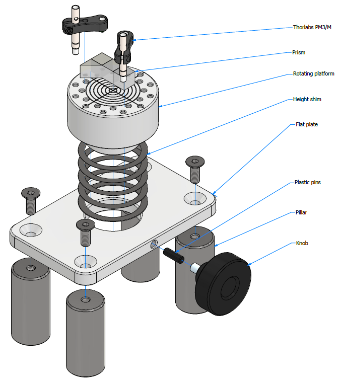

For adjusting the height of the platform, shims can be placed between the flat plate and the rotating part. Multiple shims of 0.025, 0.05, 0.1, 0.2 and 0.5 are made. 

For ease of switching between the different multiplane prisms and to avoid multiple rounds of alignment everytime, the pillars are left bolted in the microscope setup and only the prism is placed/removed from the optical path with its corresponding mount. A prism once attached to its mount via the clamping arm as shown is carefully handled so as to not change its position on the mount.
