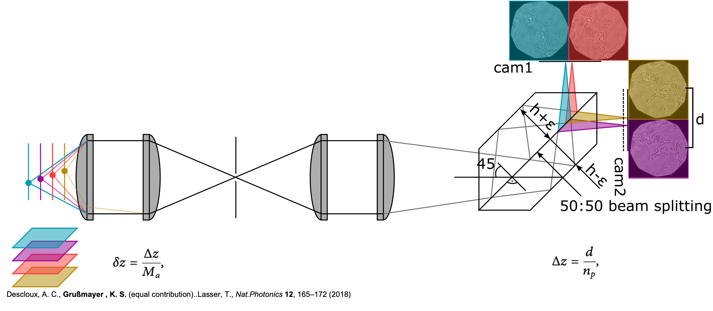
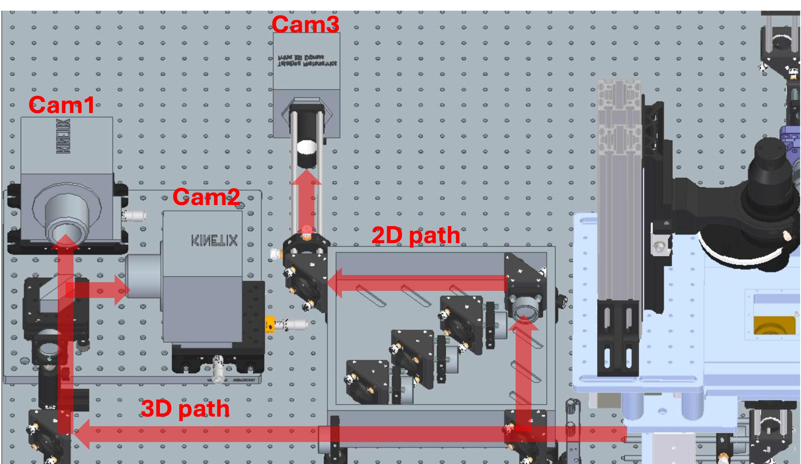
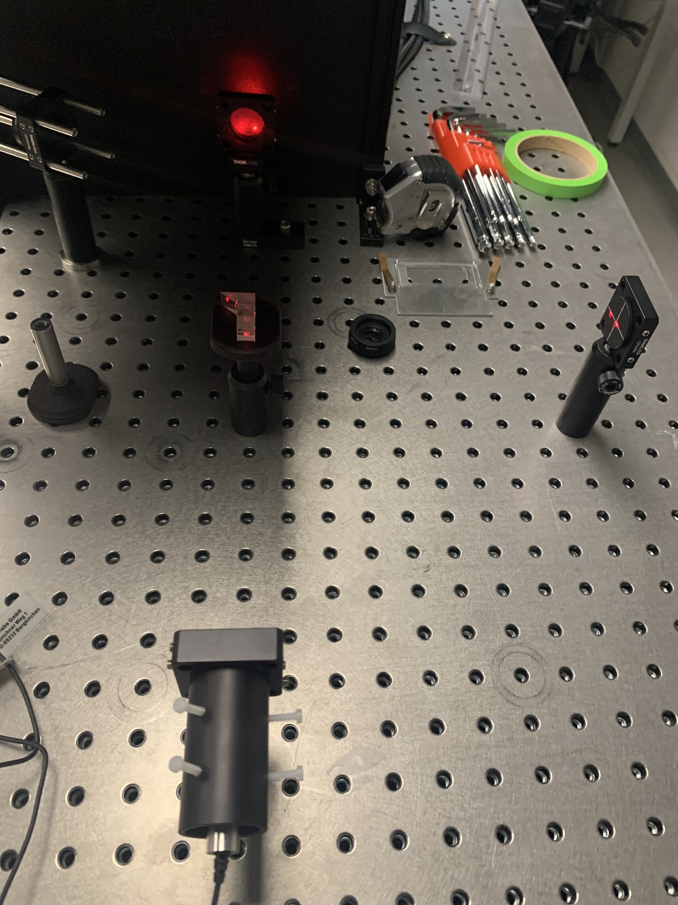
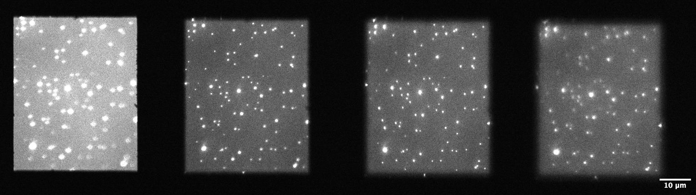

# MultiZ - a self assembled multiplane prism 
 
With optical microscopy gaining popularity as the method of choice for studying complex biological systems, the need for 3D imaging techniques become more and more pronounced (Refer this review for more details). However, many of these methods such as Confocal Laser Scanning or PSF engineering suffer from issues of speed and complexity. A simplistic and unique alternative is to use a specialized multi-plane prism to image multiple sample planes simultaneously.
In this project we have fabricated multi-plane prisms in-house using easily available off-the shelf components (based on the design of [Mertz et al.](https://opg.optica.org/optica/fulltext.cfm?uri=optica-7-11-1477&id=441827)). A multi-plane prism splits the incoming light beam from the objective lens into multiple beams and introduces path length differences between them. This essentially means that the different beam paths have different total distances from the tube lens to the camera sensor, which results in different axial planes of the sample (corresponding to the different paths) being focused side-by-side onto on the sensor (Figure 1). For a detailed theoretical framework of the multi-plane prism, information on how to design different configurations and key deciding parameters, please refer this paper by [Engelhardt et al.](https://www.frontiersin.org/journals/physics/articles/10.3389/fphy.2022.1010053/full)

For our microscope, we have dedicated 2D and 3D imaging paths (Figure 2). We have two cameras in our 3D path and based on the prism design, one or both can be used simultaneously to image multiple planes. 

In this project, we developed one 4-plane and one 6-plane self-assembled prism. There were two mechanical components required for this job- a “gluing tool” and a “mount”. 
The “gluing tool” is a 3D printed structure where we place our smaller optical pieces required to assemble the prism. This tool screws into a standard [Thorlabs post](https://www.thorlabs.com/newgrouppage9.cfm?objectgroup_id=1266) and therefore, can be used to properly position the small pieces by passing a laser beam through them and observing the output (Figure 3). This serves as a qualitative check for the alignment of the small individual pieces with respect to each other and ensures we don’t have to deal with huge shifts in the imaging planes in our output. Although, this can also be accounted for in the post-processing of multiplane data. 

The “mount” is a platform to place the assembled prism into the imaging path. It uses two or more screws to hold the prism in place. For optical alignment purposes, it allows for adjustments in height as well as rotation of the platform with respect to the cameras. The prism must be placed into the imaging path in a way that all the output imaging planes are properly focused onto the camera(s) without losing any information (Figure 4).

# Current state of the project
As part of this work, we have finished assembling two multi-plane prisms along with the design and manufacture of accompanying mechanical components. The 4-plane prism images 4 sample planes simultaneously onto the two cameras (2 planes side-by-side on each camera), whereas the 6-plane prism focuses all 6 planes (arranged in two rows of 3 side-by-side fields of view, as in Fig) on one camera. Listed below are the list of components required for each of the prisms. You can find the detailed build instructions for the gluing tool and prism mount here.

# Testing and validation
A quick quantitative check for the multiplane prism is to pass a laser beam through it while observing the outputs. As mentioned before, this gives an idea of how the outputs will be arranged on the camera and can thus, be used to make sure the spacing and positioning is proper and none of the resulting imaging planes are cropped off. 

A more quantitative assessment of the performance metrics for the different imaging planes can be made by acquiring bead stacks. These are movies of immobilized fluorescent beads on a glass slide as the sample is scanned across the Z axis. The bead stacks can then be processed to estimate the resolution (lateral and axial), separation, and brightness differences between the imaging planes (see this github repo for more details on how to process the bead data). These measures are also essential to then be able to process any imaging data captured with the multiplane prism. 

# Future plans
Our plans going further with multiplane imaging is to be able to apply it to more biological contexts and different imaging modalities. For example, it might be interesting to observe protein dynamics across the cellular volume to see if protein localization within the cell affects its behaviour due to say, presence of microenvironments.

# Getting started and project support
The information provided on this page (along with this paper) should be sufficient for anyone looking to build a cost-effective multiplane prism. In case of any questions or suggestions, please get in touch with us using the "Issues" tab of this github repo.

# License information

# Special thanks
The development of the mechanical parts for the multiplane prisms was funded by the Open Hardware Stimulation Fund of the [Delft Open Hardware](https://www.tudelft.nl/open-hardware/about-us) initiative. The parts were designed and manufactured by Frank Schilder from DEMO, TU Delft.

